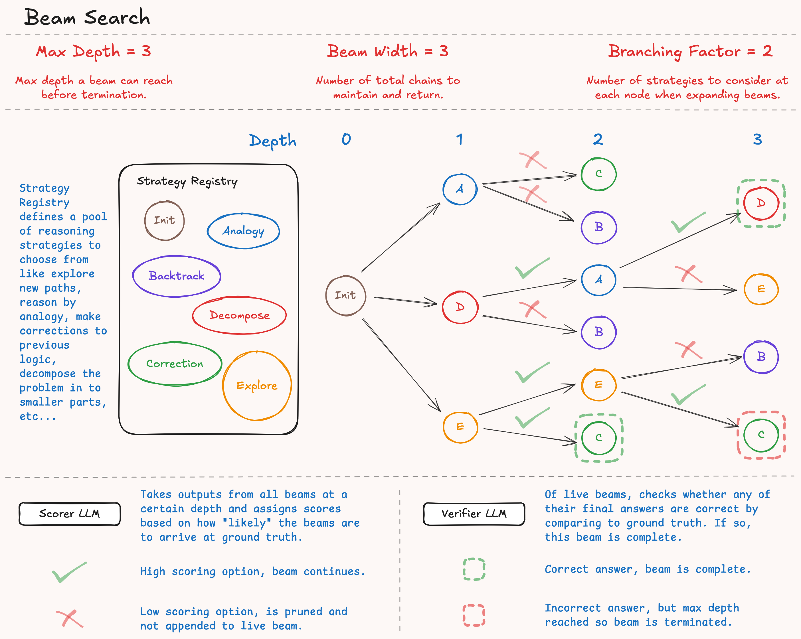

# Beam Search Algorithm

This search algorithm explores multiple reasoning paths in parallel, maintaining a "beam" (chain) of the most promising candidates at each step. The algorithm begins with an initial chain-of-thought (CoT) and iteratively expands it. At each step, it considers multiple strategies to extend each beam, evaluates the resulting paths using a scorer, 
and keeps only the top `beam_width` paths for further exploration.

<p align = "center"></p>

## Overview

Beam Search is a heuristic search algorithm that explores multiple reasoning paths simultaneously, keeping track of the most promising candidates at each level. Unlike naive linear search which follows a single path, beam search maintains multiple parallel reasoning chains and uses scoring to select the best candidates for continued exploration.

The algorithm is particularly effective for complex reasoning tasks where multiple approaches might lead to the correct answer, or where early decisions significantly impact the final outcome.

## Algorithm Flow

The beam search process follows these key steps:

1. **Initialize CoT**: Create an initial reasoning node using the Initialize strategy
2. **Initialize Beams**: Generate multiple initial beams using different strategies 
3. **Iterative Expansion**: For each depth level:
   - **Strategy Selection**: Consider multiple strategies for each active beam
   - **Candidate Generation**: Generate reasoning nodes for each strategy-beam combination
   - **Scoring & Selection**: Score all candidates and select top `beam_width` nodes
   - **Verification**: Check if any beam has reached a successful conclusion
4. **Termination**: Continue until success criteria met or maximum depth reached
5. **Result**: Return all terminal beams with their success status

## Configuration

````python
from cot_forge.reasoning.search import BeamSearch

# Basic configuration
search = BeamSearch(
    beam_width=3,           # Number of parallel beams to maintain
    branching_factor=2,     # Number of strategies to consider per beam
    max_depth=3            # Maximum reasoning depth
)

# Use with CoTBuilder
from cot_forge.reasoning import CoTBuilder
from cot_forge.reasoning.scorers import ProbabilityFinalAnswerScorer

builder = CoTBuilder(
    search_llm=llm,
    search=search,
    verifier=verifier,
    scorer=ProbabilityFinalAnswerScorer(scoring_llm)  # Required for beam search
)
```