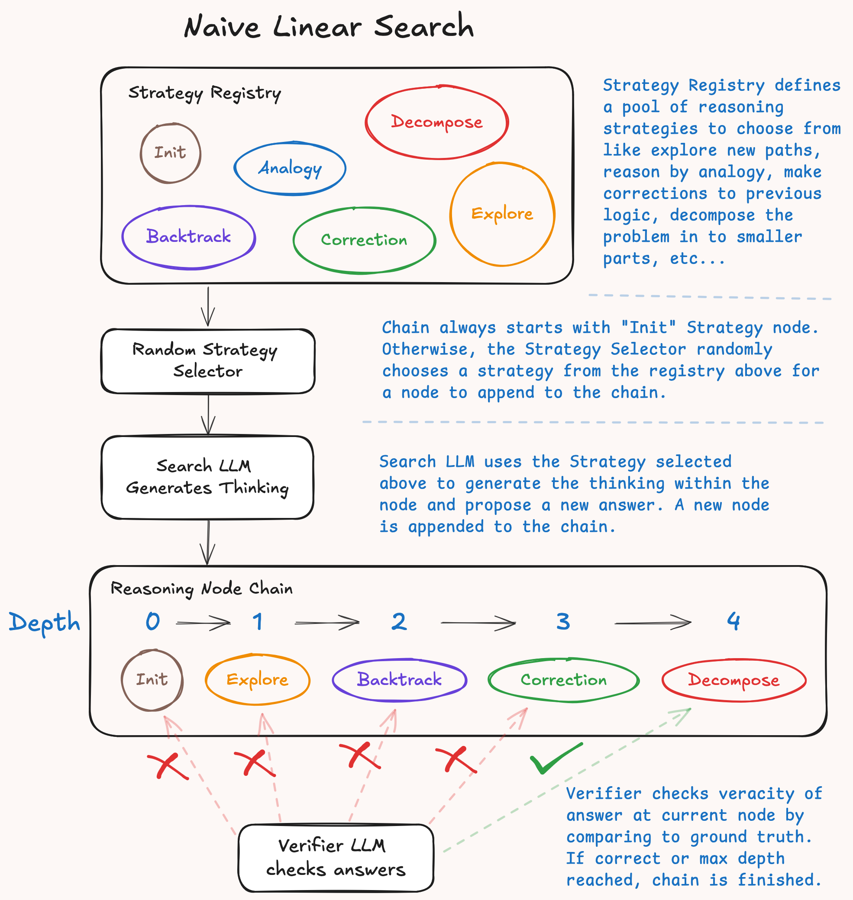

# Naive Linear Search

Naive Linear Search is a straightforward search algorithm that creates one chain of thought (CoT) by randomly sampling strategies from a strategy registry. It explores the reasoning space sequentially, building a single reasoning path until either verification succeeds or maximum depth is reached.

<p align = "center"></p>

## Overview

The Naive Linear Search algorithm implements a simple sequential approach to reasoning chain generation. Unlike more sophisticated search algorithms that maintain multiple candidate paths, this algorithm follows a single linear path through the reasoning space.

## Algorithm Flow

The search process follows these steps:

1. **Initialize**: Start with an empty reasoning chain
2. **Strategy Selection**: Randomly select a strategy from the registry based on current depth
3. **Node Generation**: Apply the selected strategy to generate a new reasoning node
4. **Verification**: Check if the current reasoning chain satisfies the success criteria
5. **Continue or Terminate**: 
   - If verification succeeds → return successful result
   - If maximum depth reached → return failure
   - Otherwise → repeat from step 2

## Configuration

````python
from cot_forge.reasoning.search import NaiveLinearSearch

# Basic configuration
search = NaiveLinearSearch(max_depth=3)

# Use with CoTBuilder
from cot_forge.reasoning import CoTBuilder

builder = CoTBuilder(
    search_llm=llm,
    search=NaiveLinearSearch(max_depth=5),
    verifier=verifier
)