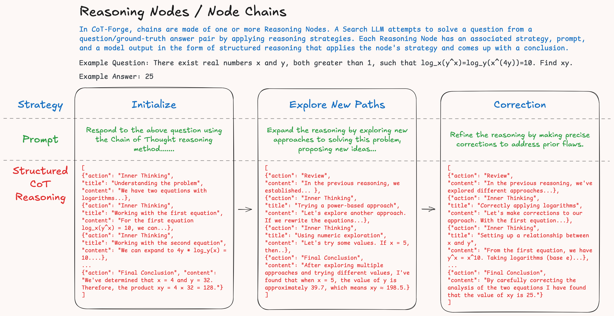

# Reasoning Nodes

<p align="center"></p>

## Overview

Reasoning Nodes are the fundamental building blocks of CoT Forge's reasoning system. Each `ReasoningNode` represents a single step in a chain of thought, containing the strategy used, the generated response, and connections to other nodes in the reasoning graph. Together, these nodes form tree-like structures that capture the complete reasoning process from initial question to final answer.

## ReasoningNode Structure

A `ReasoningNode` contains the following key components:

````python
class ReasoningNode:
    def __init__(self,
                 strategy: Strategy,        # Strategy used to generate this node
                 prompt: str,              # Input prompt for this step
                 response: str,            # Raw LLM response
                 cot: list[dict],          # Structured chain of thought steps
                 parent: ReasoningNode = None,    # Parent node reference
                 is_final: bool = False,   # Whether this is a terminal node
                 success: bool = False,    # Whether this node succeeded
                 metadata: dict = None     # Additional node information
                 ):
````

### Core Attributes

- **`id`**: Unique identifier for the node (UUID)
- **`strategy`**: The reasoning strategy applied at this step
- **`prompt`**: The complete prompt sent to the LLM
- **`response`**: The raw response from the LLM
- **`cot`**: Structured chain of thought data (list of reasoning steps)
- **`parent`**: Reference to the parent node (None for root nodes)
- **`children`**: List of child nodes extending from this step
- **`is_final`**: Boolean indicating if this is a terminal node
- **`success`**: Boolean indicating if the reasoning succeeded
- **`metadata`**: Dictionary for additional node-specific information

## Chain of Thought (CoT) Structure

Each node's `cot` attribute contains a list of reasoning steps. Each step is a dictionary with specific types:

````python
# Example CoT structure
cot = [
    {
        "type": "review",
        "content": "Let me analyze this step-by-step..."
    },
    {
        "type": "inner_thinking", 
        "content": "I need to consider multiple approaches here..."
    },
    {
        "type": "final_conclusion",
        "content": "Based on my analysis, the answer is X because..."
    }
]
````

### CoT Step Types
- **`review`**: Analysis of the current situation or problem
- **`inner_thinking`**: Internal reasoning and deliberation
- **`final_conclusion`**: Final answer or conclusion for this step

## Node Relationships

### Parent-Child Structure
Reasoning nodes form tree-like structures through parent-child relationships:

````python
# Creating a reasoning chain
root_node = ReasoningNode(strategy=InitializeCoT, ...)
child_node = ReasoningNode(strategy=AnalyzeOptions, parent=root_node, ...)
root_node.add_child(child_node)

# Accessing relationships
print(child_node.parent)  # Returns root_node
print(root_node.children)  # Returns [child_node]
````

### Tree Traversal
Nodes provide methods to traverse the reasoning tree:

````python
# Get complete chain from root to current node
full_chain = node.get_full_node_chain()

# Get the root node of the tree
root = node.get_root()

# Get complete CoT from root to current node
complete_cot = node.get_full_cot()
````

## Key Methods

### Navigation Methods

````python
# Get the complete reasoning chain
def get_full_node_chain(self) -> list[ReasoningNode]:
    """Returns ordered list from root to this node"""
    
# Get combined chain of thought
def get_full_cot(self) -> list[dict[str, Any]]:
    """Returns all CoT steps from root to this node"""
    
# Find the root node
def get_root(self) -> ReasoningNode:
    """Returns the root node of this reasoning tree"""
````

### Modification Methods

````python
# Add a child node
def add_child(self, child: ReasoningNode):
    """Adds a child node and sets parent relationship"""
    
# Convert to dictionary (for serialization)
def to_dict(self) -> dict[str, Any]:
    """Converts node to serializable dictionary"""
````

## Usage Examples

### Creating a Reasoning Chain

````python
from cot_forge.reasoning.types import ReasoningNode
from cot_forge.reasoning.strategies import InitializeCoT, AnalyzeOptions

# Create root node
root = ReasoningNode(
    strategy=InitializeCoT,
    prompt="Solve: What is 2+2?",
    response="I need to add 2 and 2 together.",
    cot=[{
        "type": "review",
        "content": "This is a basic addition problem."
    }]
)

# Create child node
child = ReasoningNode(
    strategy=AnalyzeOptions,
    prompt="Continue reasoning about 2+2",
    response="2 + 2 = 4",
    cot=[{
        "type": "final_conclusion", 
        "content": "The answer is 4."
    }],
    parent=root,
    is_final=True,
    success=True
)

root.add_child(child)
````

### Accessing Node Information

````python
# View node details
print(f"Strategy: {child.strategy.name}")
print(f"Success: {child.success}")
print(f"Is Final: {child.is_final}")
print(f"CoT Steps: {len(child.cot)}")

# Get complete reasoning path
reasoning_chain = child.get_full_node_chain()
for i, node in enumerate(reasoning_chain):
    print(f"Step {i}: {node.strategy.name}")

# Get complete chain of thought
full_cot = child.get_full_cot()
for step in full_cot:
    print(f"{step['type']}: {step['content']}")
````

### Working with Terminal Nodes

````python
# Check if node is terminal (has no children)
is_terminal = len(node.children) == 0

# Check if terminal node was successful
if node.is_final and node.success:
    print("Successfully reached conclusion!")

# Extract final answer from successful node
from cot_forge.utils.parsing import extract_final_answer_from_cot
if node.success:
    answer = extract_final_answer_from_cot(node.cot)
    print(f"Final Answer: {answer}")
````

## Node States

### Success States
- **`success=True`**: The node's reasoning was verified as correct
- **`success=False`**: The node's reasoning was incorrect or unverified

### Finality States  
- **`is_final=True`**: This node represents a terminal point in reasoning
- **`is_final=False`**: This node can be extended with additional reasoning steps

### Pruning States
- **`pruned=True`**: This node was eliminated during search (not actively used in current implementation)
- **`pruned=False`**: This node remains active in the search

## Node Metadata

The `metadata` dictionary can store additional information:

````python
node = ReasoningNode(
    strategy=strategy,
    prompt=prompt,
    response=response,
    cot=cot,
    metadata={
        "generation_time": 1.23,
        "token_count": 150,
        "confidence_score": 0.85,
        "strategy_selection_reason": "highest_score"
    }
)

# Access metadata
print(f"Generation took: {node.metadata['generation_time']}s")
````

## Serialization

Nodes can be serialized for storage and later reconstruction:

````python
# Convert node to dictionary (excludes parent/children to avoid cycles)
node_dict = node.to_dict()

# Example serialized format
{
    "id": "550e8400-e29b-41d4-a716-446655440000",
    "strategy": "analyze_options",
    "prompt": "Consider the following options...",
    "response": "After analyzing the options...",
    "cot": [{"type": "review", "content": "..."}],
    "is_final": True,
    "success": True,
    "metadata": {"confidence": 0.9}
}
````

## Integration with Search Results

Reasoning nodes are typically accessed through `SearchResult` objects:

````python
# Get nodes from search result
search_result = builder.build(question, ground_truth)

# Access terminal nodes
terminal_nodes = search_result.terminal_nodes
successful_nodes = search_result.get_successful_terminal_nodes()

# Work with individual nodes
for node in successful_nodes:
    reasoning_path = node.get_full_node_chain()
    complete_cot = node.get_full_cot()
    
    print(f"Reasoning steps: {len(reasoning_path)}")
    print(f"Total CoT steps: {len(complete_cot)}")
````

## Best Practices

### Node Creation
- Set `parent` relationships when creating child nodes
- Use `add_child()` to maintain bidirectional relationships
- Set `is_final=True` for terminal nodes
- Mark `success=True` only after verification

### Tree Structure
- Maintain single root per reasoning tree
- Avoid circular references in parent-child relationships
- Use unique IDs for node identification
- Store relevant metadata for debugging and analysis

### CoT Management
- Structure CoT steps with appropriate types
- Include clear reasoning in each step
- Use final_conclusion for terminal reasoning
- Keep steps focused and coherent

## Performance Considerations

- **Memory Usage**: Large reasoning trees consume significant memory
- **Traversal Cost**: Deep trees require more time for full chain retrieval
- **Serialization Size**: Complex trees create large serialized representations
- **Reference Management**: Parent-child references prevent garbage collection of partial trees

Consider pruning unsuccessful branches and limiting tree depth for optimal performance in production scenarios.
